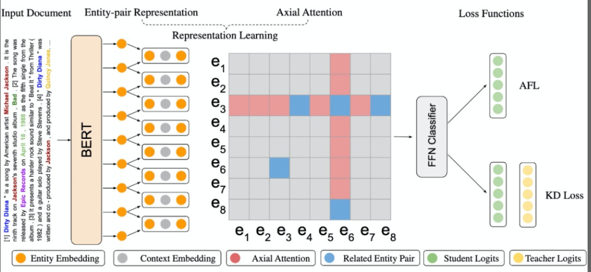
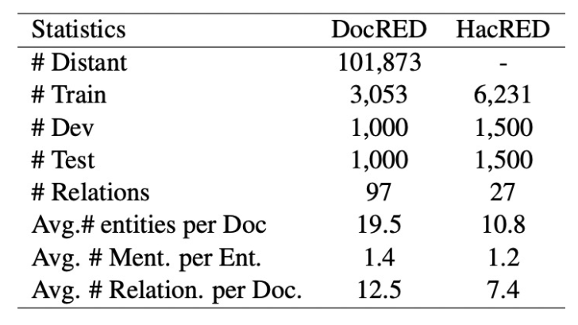
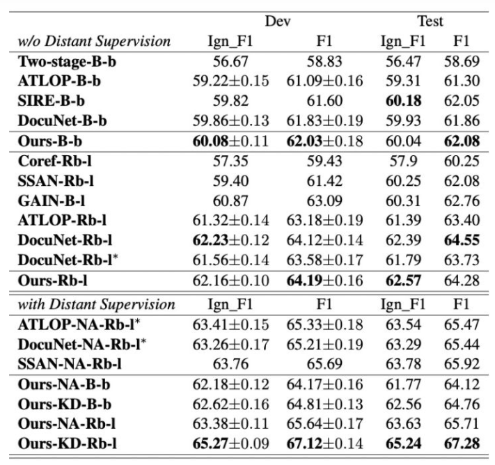
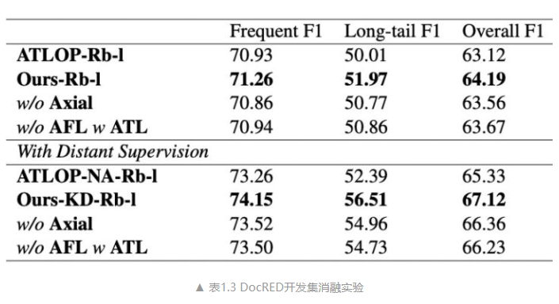
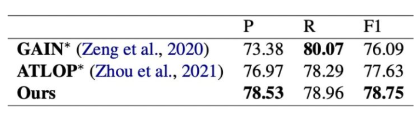

# 【关于 自适应Focal Loss和知识蒸馏的文档级关系抽取】 那些的你不知道的事

> 作者：杨夕
> 
> 项目地址：https://github.com/km1994/nlp_paper_study
> 
> NLP 面经地址：https://github.com/km1994/NLP-Interview-Notes
> 
> 个人介绍：大佬们好，我叫杨夕，该项目主要是本人在研读顶会论文和复现经典论文过程中，所见、所思、所想、所闻，可能存在一些理解错误，希望大佬们多多指正。
> 
> 论文：Document-Level Relation Extraction with Adaptive Focal Loss and Knowledge Distillation
> 
> 发表会议：ACL 2022
> 
> 论文地址：https://arxiv.org/abs/2203.10900
> 
> github：https://github.com/tonytan48/KD-DocRE

## 一、摘要

Document-level Relation Extraction (DocRE) is a more challenging task compared to its sentence-level counterpart. It aims to extract relations from multiple sentences at once. In this paper, we propose a semi-supervised framework for DocRE with three novel components. Firstly, we use an axial attention module for learning the interdependency among entity-pairs, which improves the performance on two-hop relations. Secondly, we propose an adaptive focal loss to tackle the class imbalance problem of DocRE. Lastly, we use knowledge distillation to overcome the differences between human annotated data and distantly supervised data. We conducted experiments on two DocRE datasets. Our model consistently outperforms strong baselines and its performance exceeds the previous SOTA by 1.36 F1 and 1.46 Ign_F1 score on the DocRED leaderboard. 

- 动机：与句子级对应物相比，文档级关系提取 (DocRE) 是一项更具挑战性的任务。它旨在一次从多个句子中提取关系。
- 论文方法：提出了一个包含三个新组件的 DocRE 半监督框架。
  - 首先，我们使用轴向注意力模块来学习实体对之间的相互依赖关系，从而提高了两跳关系的性能。
  - 其次，我们提出了一种自适应焦点损失来解决 DocRE 的类不平衡问题。
  - 最后，我们使用知识蒸馏来克服人工注释数据和远程监督数据之间的差异。
- 实验结果：对两个 DocRE 数据集进行了实验。我们的模型始终优于强大的基线，其性能在 DocRED 排行榜上超过了之前的 SOTA 1.36 F1 和 1.46 Ign_F1 分数。

## 二、论文动机

- 传统的关系抽取任务 集中在 句子级别关系抽取：抽取单个句子中 实体关系三元组；
- 真实的应用场景中，大量的实体关系是由多个句子联合表达的；
  - 介绍：给定一个文档 D，其中的实体数目为 N，模型需要预测所有实体对之间的关系，总共需要**做 N（N-1）个实体对的关系分类**。
- 文档级别的关系抽取 存在问题：
  - **大部分文档级别的实体关系横跨多个句子**，关系抽取模型需要捕捉更长的上下文信息；
  - **同一文档中包含大量实体，文档级别关系抽取需要同时抽取所有实体间的关系**，其复杂度与文档中的实体数成平方关系，分类过程中存在大量的负样本；
  - **文档级别关系抽取的样本类别属于长尾分布**。以清华大学发布的 DocRED 数据集为例，频率前十的关系占到了所有关系的 60%，而剩下的 86 种关系只占全部关系三元组的 40%；
  - 由于文档级别的数据标注任务较难，现有的数据集中人工标注的训练数据十分有限。大量的训练数据为远程监督[2]的训练数据，而**远程监督的数据中存在大量的噪音，限制模型的训练**。

## 三、论文方法

- 提出了一个基于知识蒸馏的半监督学习框架，和一个新的关系抽取的模型

- 在前人工作 ATLOP 模型[3]的基础上，我们提出的模型主要提供了三个新的模块:
  
1. **利用轴向注意力机制[4]来提取实体对表示之间的相互关系**。如上图所示，图中的红色部分代表实体对（e3,e6）的相关区域，例如假设 e3 为杭州，e6 为亚洲，而中间实体 e8 为中国，那么（e3 杭州, e6 亚洲, 大洲）这一关系可以通过（e3 杭州, e8 中国，国家）这一三元组和（e8 中国，e6 亚洲，大洲）这一三元组联合推理得到；
2. 为了缓解关系抽取数据中的样本不平衡的问题，受 Focal Loss[5]启发，我们**提出使用 Adaptive Focal Loss 来提高模型在长尾关系上的表现**，具体形式为缩放高频关系的概率输出以及放大一些低频关系的概率输出，详细的方法在文章的章节 2.2.2 中。
3. **在训练过程中利用知识蒸馏的机制来过滤远程监督数据中的噪音**。DocRED 数据集中包含大量的远程监督的数据，传统的方法仅采用远程监督数据进行预训练，而忽略了远程监督数据中的噪音，我们将这一基准方法记为 Naïve Adaptation（NA），作为对比我们将知识蒸馏[6]的方法记为 KD，
   1. 首先利用 DocRED 的少量人工标注训练数据训练一个老师模型；
   2. 再利用这个老师模型，对于所有的远程监督数据进行预测，其输出的概率分布会被作为软标签；
   3. 接下来我们会基于这些软标签，和远程监督数据中带有噪音的标签训练一个结构相同学生模型，学生模型的训练过程中有两个损失函数，
      1. 第一个就是之前提到的 Adaptive Focal Loss，用来学习远程监督数据中的标签。
      2. 第二个就是基于老师模型输出的软标签计算的均方误差（MSE），这一损失函数可以尽可能让学生模型的输出更接近于老师模型，这两个损失函数将会被相加并共同训练。
   4. 最后，所训练得到的学生模型会进一步在人工标注的数据中进行微调，得到我们的最终模型。

## 四、实验结果

实验结果如上表所示，其中我们的模型记为 Ours-B-b 和 Rb-l 分别指的是 Bert-base 和 Roberta-large 语言模型。我们的模型相对于之前的基线模型均取得了显著的提升，并且在 DocRED 排行榜上，我们的 KD-Roberta 模型相对于之前的 SOTA-SSAN-NA[8]提高了 1.36 F1 以及 1.46 Ign_F1。

## 五、消融实验

在 DocRED 数据集上，我们针对高频关系（前十种关系）以及长尾关系（剩余 86 种关系）进行了消融实验，从上表（表1.3）可以看到，我们的 AFL 和轴向注意力模块都能有效提高模型在长尾关系上的表现。

我们同样在 HacRED 数据集上做了对比实验（表1.4），但由于 HacRED 尚未公布测试集，我们只汇报了相同场景下开发集的结果。

## 六、总结

提出了一个基于知识蒸馏的半监督学习框架，并且基于轴向注意力和自适应聚焦函数提出了一个新的文档级别关系抽取的模型，并且在 DocRED 排行榜显著超过了 SOTA 的表现。

## 参考资料

1. [基于自适应Focal Loss和知识蒸馏的文档级关系抽取](https://zhuanlan.zhihu.com/p/490792345)