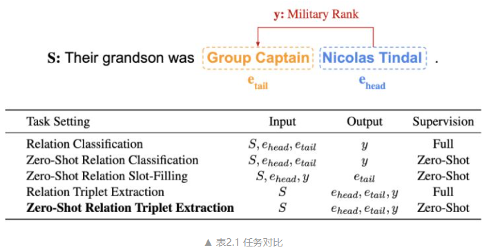
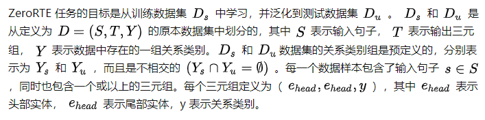
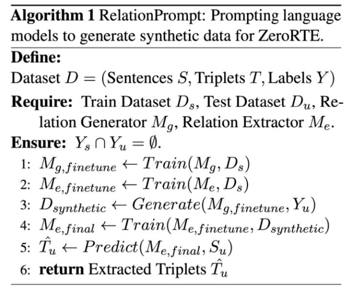
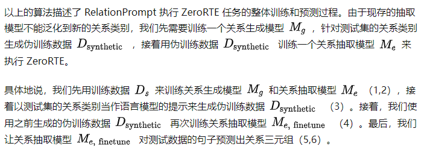
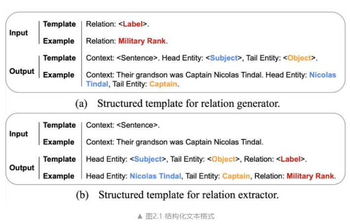
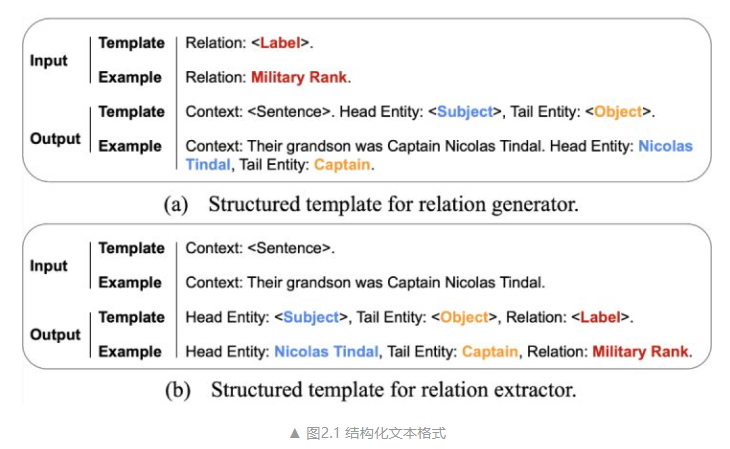
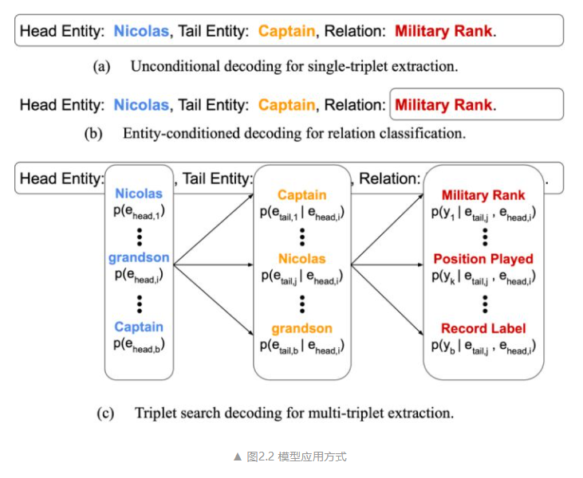
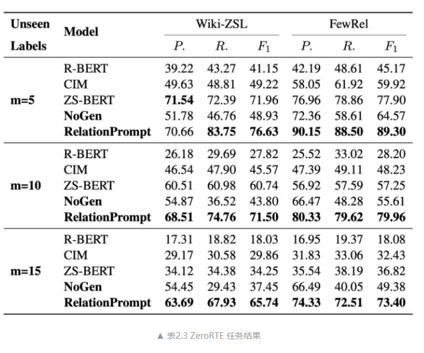

# 【关于 RelationPrompt】 那些的你不知道的事

> 作者：杨夕
> 
> 项目地址：https://github.com/km1994/nlp_paper_study
> 
> NLP 面经地址：https://github.com/km1994/NLP-Interview-Notes
> 
> 个人介绍：大佬们好，我叫杨夕，该项目主要是本人在研读顶会论文和复现经典论文过程中，所见、所思、所想、所闻，可能存在一些理解错误，希望大佬们多多指正。
> 
> 论文：RelationPrompt: Leveraging Prompts to Generate Synthetic Data for Zero-Shot Relation Triplet Extraction
> 
> 发表会议：ACL 2022
> 
> 论文地址：https://arxiv.org/abs/2203.09101
> 
> github：https://github.com/declare-lab/RelationPrompt 【未更新】

## 一、摘要

Despite the importance of relation extraction in building and representing knowledge, less research is focused on generalizing to unseen relations types. We introduce the task setting of Zero-Shot Relation Triplet Extraction (ZeroRTE) to encourage further research in low-resource relation extraction methods. Given an input sentence, each extracted triplet consists of the head entity, relation label, and tail entity where the relation label is not seen at the training stage. To solve ZeroRTE, we propose to synthesize relation examples by prompting language models to generate structured texts. Concretely, we unify language model prompts and structured text approaches to design a structured prompt template for generating synthetic relation samples when conditioning on relation label prompts (RelationPrompt). To overcome the limitation for extracting multiple relation triplets in a sentence, we design a novel Triplet Search Decoding method. Experiments on FewRel and Wiki-ZSL datasets show the efficacy of RelationPrompt for the ZeroRTE task and zero-shot relation classification.

- 动机：尽管关系提取在构建和表示知识方面很重要，但**很少有研究集中在推广到看不见的关系类型**。
- 论文方法：
  - 介绍了零样本关系三元组提取（ZeroRTE）的任务设置，以鼓励对低资源关系提取方法的进一步研究。给定一个输入句子，每个提取的三元组由头部实体、关系标签和尾部实体组成，其中在训练阶段看不到关系标签。
  - 为了解决 ZeroRTE，我们建议通过提示语言模型生成结构化文本来合成关系示例。具体来说，我们**统一语言模型提示和结构化文本方法来设计结构化提示模板，用于在以关系标签提示（RelationPrompt）为条件时生成合成关系样本**。
  - 为了克服在句子中提取多个关系三元组的局限性，我们设计了一种新颖的三元组搜索解码方法。
- 实验结果：在 FewRel 和 Wiki-ZSL 数据集上的实验显示了 RelationPrompt 对 ZeroRTE 任务和零样本关系分类的有效性。

## 二、论文动机

- **问题一：未出现关系无法识别**。传统的关系抽取任务 无法处理 针对训练时候未见过的关系类别执行三元组抽取（Relation Triplet Extraction）

> eg 1：“Their grandson was Group Captain Nicolas Tindal.” 包含了 “Military Rank”的关系，但是训练数据没有见过这类关系类别的样本

- ZeroRTE ：
  - 目标：在这个零样本的情况下仍然能够抽取 eg1 中三元组（Nicolas Tindal，Military Rank, Group Captain）
  - 局限性：
    - 与传统监督的关系三元组抽取（Relation Triplet Extraction）任务相比，ZeroRTE 需要模型泛化到训练中从没遇过的关系类别。
    - 与零样本关系分类的任务（Zero-Shot Relation Classification）（ZeroRC）[10]相比，ZeroRTE 需要模型在不假设给出实体对的情况下抽取完整的关系三元组。
- RelationPrompt：
  - 目标：**为未出现关系类别生成伪训练数据（Pseudo-training data）**；利用初次见到的关系名作为语言模型的提示（Prompt），生成该关系的结构化句子样本。这类样本的结构信息标明了句子中三元组的头部实体（Head Entity）和尾部实体（Tail Entity），进而可以作为抽取模型的训练数据。

- **问题二：现有低资源学习问题的局限性**。
  - **远程监督（Distant Supervision）**可用知识库构建大规模的关系数据集，但**比人类的标注质量低，并且仅限于固定关系类别**；
  - **设计不受约束的预测类别空间来制定任务目标**，例如句子相似度匹配。然而，现存的方式**只对句子分类任务有效，不能直接执行三元组抽取任务**；
  - **利用带有提示（Prompt）的语言模型**，能让模型在低资源情况下泛化到新任务。然而，提示的方法目前**仅限于比较简单的预测目标，比如句子分类或词组抽取**。

## 三、论文方法

### 3.1 任务定义

### 3.1.1 ZeroRTE 任务定义

### 3.1.2 RelationPrompt 任务定义

### 3.1.3 模型介绍

- 动机：
  - 方法：
    - 语言模型能够通过大规模的预训练，泛化到地资源的情况。因此，我们使用语言模型生成伪训练数据，以关系名称的提示作为生成的条件。
      - 问题：
        - 现存的提示方式不能支持生成三元组的信息。
    - 结构化文本方式（Structured Text）可以使用自然文本中的特殊标记，对实体和关系的结构信息进行编码。
- 思路：统一了提示语言模型和结构化文本的方法，能通过语言模型提来生成带有关系三元组信息的结构化文。
- RelationPrompt 模型
  - 关系生成模型（a）（图 2.1a）
    - 输入：包含关系名称的提示；
    - 输出：包含句子、头部实体和尾部实体的结构化文本；
    - 思路：使用 GPT-2 模型和普通的训练目标进行训练，进而生成的样本可用于训练关系抽取模型。具体来说，我们对关系抽取模型采用 BART 模型的序列到序列方法
  - 关系抽取模型（b）（图 2.1b）
    - 输入数据：如何包含上下文句子；
    - 输出格式：包含头部实体、尾部实体和关系名称来形成关系三元组；
    - 思路：使用普通的序列到序列学习目标[16]来训练模型

所设计的结构化文本格式能让关系抽取模型同时支持关系三元组抽取和关系分类。

如图 2.2 显示，我们可以无条件地生成带有头部实体，尾部实体和关系类别的结构化文本，对 ZeroRTE 任务做预测（a）。另外，我们能以实体对信息为条件来生成关系类别，对 ZeroRC 任务做预测（b） 。因此，我们的关系抽取模型在预测时可以支持 ZeroRTE 和 ZeroRC 任务，不需要分别的训练。由于结构化文本格式的复杂度会影响到关系生成模型的生成质量， 我们保持生成的结构化文本最多包含一个三元组。因此，关系抽取模型在伪数据训练之后，对每一个输入句子最多预测一个三元组。为了克服这个挑战并预测多个三元组，我们进一步提出了一种生成解码方法（c）。

该方法可以在序列到序列的预测阶段枚举三元组候选并进行排名。对于头部实体、尾部实体和关系名称，我们可以在各个部分考虑多个可能的候选实体。如图 2.2c 表示，每个可能路径代表了一个三元组候选。为了筛选最合适的三元组候选，我们使用分数阈值。只有总体可能性高于得分数阈值的路径才能被预测为最终的关系三元组。

## 四、实验结果

## 五、总结

介绍了零样本关系三元组抽取任务（ZeroRTE），要求模型在测试情况下抽取未见过的关系类别的三元组。与之前零样本关系分类任务（ZeroRC）相比，ZeroRTE 不需要假设实体对已经被提供。因此，ZeroRTE 在实际应用中更现实。为了执行 ZeroRTE，我们提出了关系提示的方式（RelationPrompt），利用关系名称当作语言模型的提示，来生成未见过的关系类别的新的句子样本。

为了克服句子中多个关系三元组的挑战，我们也设计了新的三元组搜索解码方法（Triplet Search Decoding）。实验结果表明，RelationPrompt 比基线模型更有效，在 ZeroRTE 任务能达到 16.5 F1 提升，在 ZeroRC 任务能达到 28.2 F1 提升。

## 参考资料

1. [RelationPrompt：通过提示语言模型的数据生成来解决零样本关系三元组抽取任务](https://zhuanlan.zhihu.com/p/490792345)