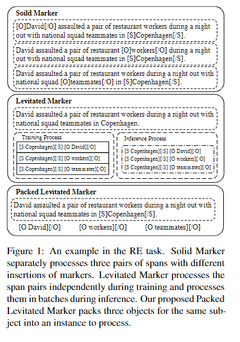
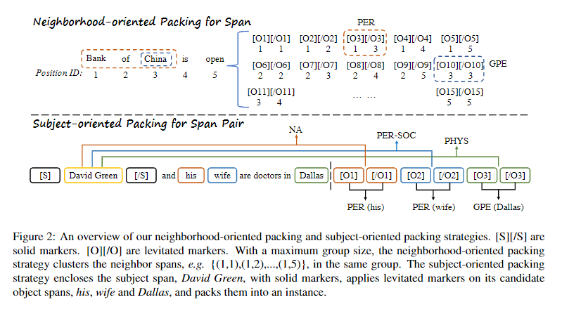
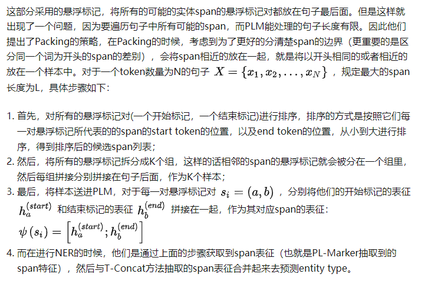
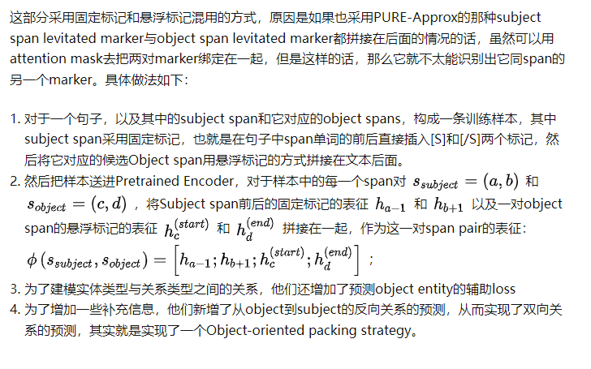
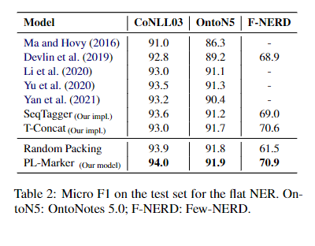
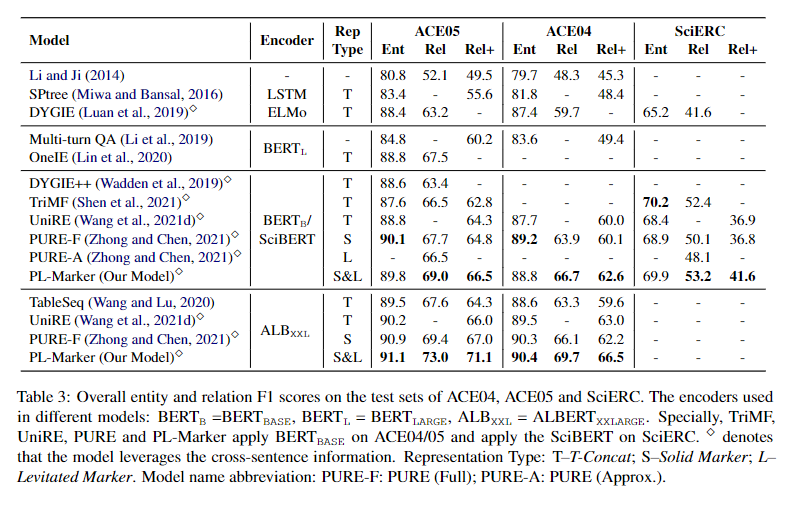
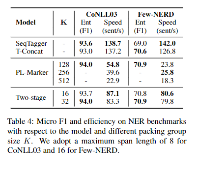
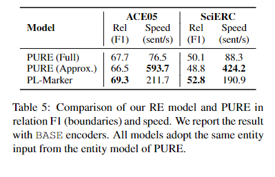

# 【关于 PL-Marker】 那些你不知道的事

> 作者：杨夕
> 
> 项目地址：https://github.com/km1994/nlp_paper_study
> 
> 论文名称：《Packed Levitated Marker for Entity and Relation Extraction》
> 
> 会议：ACL2022
> 
> 论文地址：https://arxiv.org/abs/2109.06067v4
> 
> 源码地址：https://github.com/thunlp/PL-Marker
> 
> 个人介绍：大佬们好，我叫杨夕，该项目主要是本人在研读顶会论文和复现经典论文过程中，所见、所思、所想、所闻，可能存在一些理解错误，希望大佬们多多指正。

## 摘要

Recent entity and relation extraction works focus on investigating how to obtain a better span representation from the pre-trained encoder. However, a major limitation of existing works is that they ignore the interrelation between spans (pairs). In this work, we propose a novel span representation approach, named Packed Levitated Markers (PL-Marker), to consider the interrelation between the spans (pairs) by strategically packing the markers in the encoder. In particular, we propose a neighborhood-oriented packing strategy, which considers the neighbor spans integrally to better model the entity boundary information. Furthermore, for those more complicated span pair classification tasks, we design a subject-oriented packing strategy, which packs each subject and all its objects to model the interrelation between the same-subject span pairs. The experimental results show that, with the enhanced marker feature, our model advances baselines on six NER benchmarks, and obtains a 4.1%-4.3% strict relation F1 improvement with higher speed over previous state-of-the-art models on ACE04 and ACE05.

最近的实体和关系提取工作专注于研究如何从预训练的编码器中获得更好的span表示。

- 动机：现有作品的一个主要限制是它们忽略了span（对）之间的相互关系。
- 论文工作：提出了一种新的span表示方法，称为 Packed Levitated Markers (PL-Marker):
  - 通过战略性地在编码器中 packing the markers 来考虑span（对）之间的相互关系。
  - 提出了一种 neighborhood-oriented packing strategy ，该策略综合考虑了邻域span，以更好地建模实体边界信息。
  - 对于那些更复杂的span对分类任务，我们设计了一种面向主题的 packs  策略，将每个主题及其所有对象 packs  ，以模拟同一主题span对之间的相互关系。实验结果表明，通过增强标记特征，
- 论文结果：在六个 NER 基准上推进了基线，并且在 ACE04 和 ACE05 上比之前的最先进模型更快地获得了 4.1%-4.3% 的严格关系 F1 改进.

## 一、前沿介绍篇

- 目前关系抽取算法 按处理方式 分类：
  - pipeline approach：先抽实体，再判关系
    - eg: 陈丹琦的《A Frustratingly Easy Approach for Joint Entity and Relation Extraction 》（后面称为PURE）
  - Joint Entity and Realtion Extraction：联合模型，通过将 将联合任务 转化为以下问题：
    - 填表问题，比如：table sequence，TPlinker
    - 序列标注问题，比如：ETL Span，PRGC
    - seq2seq问题，比如：SPN4RE

## 二、动机

 PL-Marker 作为 pipeline 方法的一种，与 PURE 类似：

- PURE
  - 思路：
    - 先抽实体: 将文本送入PLM中获取每个token的上下文表征，然后将每个span的start token、end token的上下文表征以及span长度的embedding拼接在一起得到span的表征，然后送进两层前馈神经网络，最后预测entity type;
    - 再判关系: 采用了往句子中的subject span和object span的前后插入“typed marker”的方式，这个typed marker就是一对标记，object span的 typed marker 为 start marker [O: entity_type]和end marker [/O: entity_type]，Subject span的[S: entity_type]和[/S: entity_type]。通过这种方式对句子改造以后，将改造后的句子送入PLM，然后将 subject span 和 Object 的start marker 的上下文表征拼接在一起作为span的表征，然后过线性变换和softmax预测这个span的relation type。（后面称为PURE-Full）
  - 存在问题：对于 每一个训练和预测样本，由于只能插入一对subject span和object span，所以计算量很大

## 三、论文思路

- PL-Marker 提出了一些优化方法
  - 优化方法一：
    - 动机：PURE 所存在 的 计算量问题 
    - 思路：
      - 首先，将typed marker全部放在句子末尾；
      - 然后，通过让typed marker与相应的subject span或object span中的头/尾单词共享position embedding，并且利用attention mask矩阵来完成一些限定；
      - typed marker进可以与文本以及当前span pair内的typed marker进行attention， text仅可以与text进行attention
    - 优点：可以在一个句子中并行处理多对span pairs了，他们提出的这种加速方法提升了关系抽取的速度；
    - 缺点：效果略有下降
  - 优化方法二：
    - 动机：优化方法一所带来的性能下降问题
    - 在之前的工作中，有三种span表征方式：
      - **T-Concat**：这种方式**将span 的start 和end token的representation拼接起来作为span的representation**，也就是PURE中NER用的方式，其实很多模型都用的这种方式；
      - **Solid Marker（固定标记）**：
        - 思路：显式的在句子中的span前后插入两个marker，如果是关系抽取，就在subject span和object span前后；
        - 存在问题：**没法一次性处理多对span**，因为在句子中要塞入多对marker的话，不但句子结构会很乱，而且对于有交叉的span也不好处理。PURE-Full就用的这种方式。
      - **Levitated Marker（悬浮标记）**：就是PURE-Approx，这里不赘述了，目前仅有PURE-Approx中用了这种方式，效果相较于PURE-Full是有折扣的，论文中认为简单将悬浮标记放到句子后面的方式没有考虑多个span之间的关联；
    - 论文 span表征方式：
      - 对 **Solid Marker（固定标记）** 和 **Levitated Marker（悬浮标记）** 进行结合
      - 提出两种 packing the markers 方式：
        - 在做NER的时候提出了：**Neighborhood-oriented Packing for span，就是将相邻的span的悬浮标记拼接在同一个样本里面**；
        - 在做RE的时候提出了：**Subject-oriented Packing for span pair，就是将subject span用固定标记插入句子中，其对应的Object span们，用悬浮标记拼接在句子后面，放在一个样本里面**；

## 四、整体框架介绍篇

> PL-Marker的两种标签打包策略

PL-Marker使用的模型就是PLM，与PURE-Approx类似：

- 拼接在句子后面的悬浮标记对中的start marker与其在句子中对应的span的start token共享position embedding，end marker与对应span的end token共享 position embedding；
- 通过attention mask矩阵进行限制，使得悬浮标记可以看到它的搭档标记和前面的文本，看不到其他悬浮标记对，文本仅可以看到文本

### 4.1 NER部分：Neighborhood-oriented Packing for span

### 4.2 RE部分：Subject-oriented Packing for span pair

## 五、实验效果

### 5.1 NER 效果

### 5.2 RE 效果

### 5.3 速度

## 参考资料

1. [<关系抽取>ACL2022关系抽取SOTA之PL-Marker](https://zhuanlan.zhihu.com/p/496000441)

