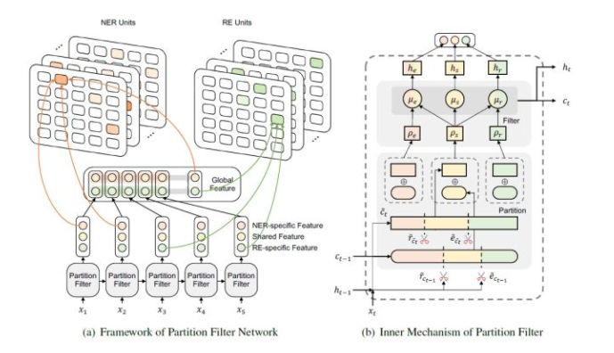

# 【关于 PFN】 那些你不知道的事

> 作者：杨夕
> 
> 项目地址：https://github.com/km1994/nlp_paper_study
> 
> 论文名称：PFN:A Partition Filter Network for Joint Entity and Relation Extraction
> 
> 会议：EMNLP2021
> 
> 论文地址：https://arxiv.org/abs/2108.12202v8
> 
> 源码地址：https://github.com/Coopercoppers/PFN
> 
> 个人介绍：大佬们好，我叫杨夕，该项目主要是本人在研读顶会论文和复现经典论文过程中，所见、所思、所想、所闻，可能存在一些理解错误，希望大佬们多多指正。

## 摘要

In joint entity and relation extraction, existing work either sequentially encode task-specific features, leading to an imbalance in inter-task feature interaction where features extracted later have no direct contact with those that come first. Or they encode entity features and relation features in a parallel manner, meaning that feature representation learning for each task is largely independent of each other except for input sharing. We propose a partition filter network to model two-way interaction between tasks properly, where feature encoding is decomposed into two steps: partition and filter. In our encoder, we leverage two gates: entity and relation gate, to segment neurons into two task partitions and one shared partition. The shared partition represents inter-task information valuable to both tasks and is evenly shared across two tasks to ensure proper two-way interaction. The task partitions represent intra-task information and are formed through concerted efforts of both gates, making sure that encoding of task-specific features is dependent upon each other. Experiment results on six public datasets show that our model performs significantly better than previous approaches. In addition, contrary to what previous work has claimed, our auxiliary experiments suggest that relation prediction is contributory to named entity prediction in a non-negligible way. The source code can be found at this https URL.

- 动机：
  - 在联合实体和关系提取中，现有工作要么顺序编码任务特定的特征，导致任务间特征交互的不平衡，即后来提取的特征与先提取的特征没有直接联系。
  - 或者它们以并行方式编码实体特征和关系特征，这意味着每个任务的特征表示学习在很大程度上是相互独立的，除了输入共享。
- 论文方法：提出了一个分区过滤网络来适当地模拟任务之间的双向交互，
  - 其中特征编码被分解为两个步骤：分区和过滤。
    - 在我们的编码器中，我们利用两个门：实体门和关系门，将神经元分割成两个任务分区和一个共享分区。
    - 共享分区代表对两个任务都有价值的任务间信息，并在两个任务之间均匀共享，以确保正确的双向交互。
    - 任务分区代表任务内信息，并通过两个门的共同努力形成，确保任务特定特征的编码相互依赖。
- 论文实验：在六个公共数据集上的实验结果表明，我们的模型比以前的方法表现得更好。此外，与之前的工作所声称的相反，我们的辅助实验表明关系预测对命名实体预测的贡献是不可忽略的。

## 一、模型

## 参考资料

1. [A Partition Filter Network for Joint Entity and Relation Extraction](https://arxiv.org/abs/2108.12202v8)

