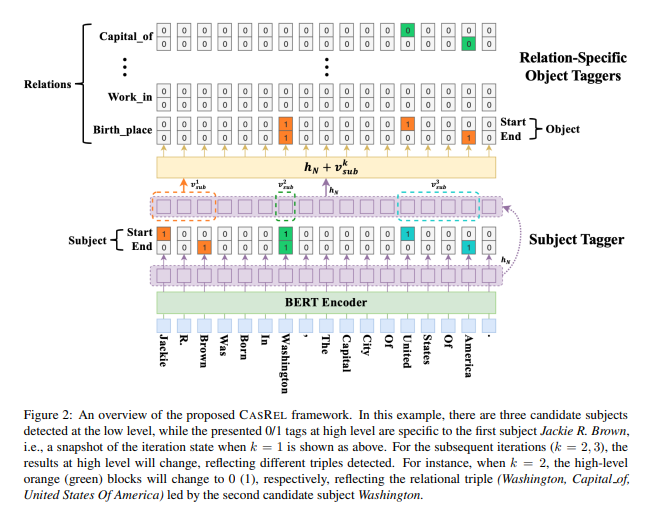

# 【关于 实体-关系联合抽取 】 那些你不知道的事 

> 作者：杨夕
> 
> 介绍：研读顶会论文，复现论文相关代码

> 论文：
>
> 会议：
> 
> 论文地址：
> 
> NLP 百面百搭 地址：https://github.com/km1994/NLP-Interview-Notes
> 
> 推荐系统 百面百搭 地址：https://github.com/km1994/RES-Interview-Notes
> 
> 搜索引擎 百面百搭 地址：https://github.com/km1994/search-engine-Interview-Notes 【编写ing】
> 
> NLP论文学习笔记：https://github.com/km1994/nlp_paper_study
> 
> 推荐系统论文学习笔记：https://github.com/km1994/RS_paper_study
> 
> GCN 论文学习笔记：https://github.com/km1994/GCN_study
> 
> **推广搜 军火库**：https://github.com/km1994/recommendation_advertisement_search

> 手机版笔记，可以关注公众号 **【关于NLP那些你不知道的事】** 获取，并加入 【NLP && 推荐学习群】一起学习！！！

## 一、基础概念

- 实体抽取：是对句子中实体赋予相应的语义标签，通常也称为命名实体识别(Named entity recognition, NER) 

- 关系抽取：预测句子或篇章中成对实体所存在的语义关联类型，并用三元组<Subject,Relation.Objec>表示抽取结果。

## 二、实体-关系联合抽取模式归纳

1. 基于Sequence Tagging的实体-关系联合提取
2. 基于Span Classification的实体-关系联合提取
3. 基于Binary Tagging的实体-关系联合提取
4. 基于Table Filling的实体-关系联合提取
5. 基于MRC的实体-关系联合提取
6. 基于GNN的实体-关系联合提取
7. 基于Generative的实体-关系联合抽取

## 三、基于Sequence Tagging的实体-关系联合提取

### 3.1 核心思想

- 核心思想：这将实体-关系联合抽取任务转换为序列标注任务。即利用分类器，为序列中的每一个Token赋予一个或多个标签。

### 3.2 经典文章

- Joint Extraction of Entities and Relations Based on a Novel Tagging Scheme (ACL 2017)
- Joint entity recognition and relation extraction as a multi-head selection problem (ExpertSystems with Applications 2018)
- Joint extraction of entities and relations using multi-label tagging and relational alignment(Neural Computing and Applications 2022)

### 3.3 Joint Extraction of Entities and Relations Based on a Novel Tagging Scheme (ACL 2017)

- 论文创新点：提出一种新的标注Schemma用来同时抽取文本中的实体和关系，参见下图；

> 新Scheme由三个部分构成:“word position in the entity”，“relation type”以及“relationrole";
> 
> 以图中“United”的标签“B-CP-1”为例，其中B是词在实体中的位置(分别用“BIES”表示,B表示Begin，I表示Inside，E表示End，S表示Single)，CP表示关系类型“Country President”，1表示该词在关系中的角色《1表示头实体，2表示尾实体);

- 模型架构：采用了传统的双层BILSTM，并在第二层上做一些输入内容的修改

- 存在的问题：无法解决套实体、套关系的问题。

> 改进文章: Joint extraction of entities and relations using multi-label tagging and relational alignment(Neural Computing and Applications 2022)

## 四、基于Span Classification的实体-关系联合提取

### 4.1 核心思想

- 核心思想：将实体抽取和关系抽取转化为序列中片段的分类问题，或片段之间组合后的分类任务。

### 4.2 经典文章

- Span-based Joint Entity and Relation Extraction with Transformer Pre-training (ECAI2020)
- TPLinker: Single-stage Joint Extraction of Entities and Relations Through Token PairLinking (COLING 2020)
- A Span-Based Model for Joint Overlapped and Discontinuous Named Entity Recognition(ACL 2021)

### 4.3 Span-based Joint Entity and Relation Extraction with Transformer Pre-training (ECAI2020)

#### 4.3.1 论文思路

1. 利用预训练的BERT模型作为其核心部分；BERT部分对于一个句子仅仅需要前向执行一次；
2. 抛弃了传统的BIO/BILOU标注实体的方式，构建了一个基于跨度的联合实体识别和关系抽取模型。

#### 4.3.2 模型结构

1. 输入:byte-pair encoded (BPE) tokens（和BERT的输入一致）
2. Span Classification：
   1. 本质：一个多分类模型（分类类别实体类型：person, organization, none等）
   2. 思路：片段分类部分，公先枚举序列中所有可能的片段(例如，对于文本片段“we willrock you”，枚举结果包括“we”，“we will”，“wewill rock”，“we will rock you”,“will”等)。对枚举到的特定片段(右侧红框)，先用Maxpooing获取到span表征，然后再与句子表征，宽度表征拼接，最后将该表征用于span类型分类。
   3. 输入：word embedding(实体包括的词向量进行max-pooling操作), width embedding（实体包含的词个数在width向量矩阵中找到的width向量）, cls embedding（BERT的cls向量）
   4. 输出：实体类别
3. Span Filtering：
   1. 丢弃那些被预测为None的 span;
   2. 预先过滤span size超过10的实体;
4. 关系分类：
   1. 本质：多分类模型
   2. 思路：先从S中采样一组实体对<S1，S2>，再通过一组特征变换及组合获取两实体表征，记作e(S1)，e(S2)。同时，将S1，S2之间的描述做Maxpooling获取C(S1,S2)表征。最后按照下述公式做多标签分类。
   3. 输入：word embedding1（实体1）, width embedding1（实体1）, context embedding（实体1和实体2中间的词向量进行max-pooling操作）, word embedding2（实体2）, width embedding2（实体2）
   4. 输出：关系类别
5. 损失函数

>实体分类损失 + 关系分类损失

#### 4.3.3 论文 trick

1. 负采样
   1. 实体负采样：在所有可能的实体中最多随机选取 N 个实体，并将未在训练集中被标注为正例的样本标记成负例，同时规定实体的长度不能超过10。
   2. 关系负采样：针对所有待预测的实体之间的关系，**对于出现过的所有实体任意两两组合构建关系**，对于在正样本中未出现的标注为负样本，并且最多选取 M 个负样本。

## 五、基于Binary Tagging的实体-关系联合提取

### 5.1 核心思想

- 核心思想：是将实体识别和关系提取均转化为 三元组抽取，如何准确判断实体片段的开始结束位置，从而分别设计二元分类器用以实现联合提取目标。

### 5.2 经典文章

- A Novel Cascade Binary Tagging Framework for Relational Triple Extraction (ACL 2020)
- FastRE: Towards Fast Relation Extraction with Convolutional Encoder and ImprovedCascade Binary Tagging Framework (IJCAI-ECA 2022)

### 5.3 A Novel Cascade Binary Tagging Framework for Relational Triple Extraction (ACL 2020)

#### 5.3.1 论文动机

目前一个句子仅包含一个关系三元组进行关系三元组抽取已经能够达到不错的效果。但在一个句子中包含多个关系三元组，尤其当多个三元组有重叠的情况时，模型表现的效果不尽人意。

#### 5.3.2 论文亮点

- 传统三元组抽取，是先识别subject和object，并对候选<subject,object>做关系分类。
- 新的三元组提取方法，利用概率图的思想：首先预测第一个实体s,预测出s过后传入s来预测s对应的p跟o。

#### 5.3.3 论文思路

该方法包含两个部分: Subject Tagger和Relation-specific Object Taggers部分：

- Subject Tagger: 先将序列中的每一个Token做两次二元分类，用于识别实体的开始和结束位置。

- Relation-specifie Object Taggers: 以第一阶段识别到的Subject，“Brown R.Jackle”为例，进一步识别其对应的Object。对于每一类关系下的Object，该方法同样采用Start-End分类范式实现目标Objet识别，案例“Brown R.Jackle”识别到“Birth place”关系下的两个实休“Washington”,“United Sates Of America”，而其他关系下均没有识别结果。

## 六、基于Binary Tagging的实体-关系联合提取

### 6.1 核心思想

- 核心思想：将实体抽取以及关系抽取任务转换为表格填充任务通常会将序列文本转换为一个 N*N 的矩阵，然后再通过填充矩阵中的值来表征实体和关系的位置。

### 6.2 经典文章

- Table Filling Multi-Task Recurrent Neural Network for Joint Entity and Relation Extraction (ACL 2016)
- Two are Better than One: Joint Entity and Relation Extraction with Table-Sequenee Encoders (EMNL.P2020
- Unified Named Entity Recognition as Word-Word Relation Classification (AAAI 2021)
- UNIRE: A Unifed Label Space for Entity Relation Extraction (ACL2021)
- Delving Deep into Regularity: A Simple but Effective Method for Chinese Named Entity Recognition(NAACL 2022)

### 6.3 UNIRE: A Unifed Label Space for Entity Relation Extraction (ACL2021)

#### 6.3.1 论文亮点

- 论文亮点：提出一种新的实体关系联合抽取方法，将实体和关系的标注空间统一到同一表格中，从而实现实体关系的联合提取。

#### 6.3.2 论文 实体关系 标注方式

- 这个Table的每一格都是一个Token pair，如果多个Token构成实体，其涉及的Token对被标注为对应实体类型:
  - 实体仅被对应的放在对角位置。如图中“David Perkins”。当Token pair构成关系，其在Table中两个相交的位置会被填充对应的关系类型;
  - 关系被放置在非对角位置。如”DavidPerkins”和“wife”构成关系”PER-SOC”。

#### 6.3.3 论文结构

- 模型设计上包含三个部分: Biaffine Model、Table Filling和Entity-Relation Decoding构成：

1. Biaffine Model：先用BERT将输入序列转换为H。然后利用双线性变换实现Token之间的彼此交互，计算Table的ij位置的填充值;

2. Table Filling: 在获得得分向量g之后，我们将g输入softmax函数以预测相应的标签，从而在标签空间Y上产生分类概率分布

> 优化函数

3. 上述 $g_{i,j}$ 的计算都是独立的，但实体获关系填充时cell彼此是关联的。因此，文章提出两种新的loss 来弥补这种gap。这里引入 $P∈ R^{|s|*|s|*|y|}$，表示所有 $g_{i,j}$  的组合

4. Symmetry Loss: 从上面设计的标签表示方式可以看出，实体依对角线对称，双向关系同样依对角线对称。于是，对于对称的实体或者关系计算 $L_{sym}$ 损失。

5. Implication Loss: 在同一Table中表示实体和关系时，若关系存在，那么头尾实体也应当必然存在。基于此，可以认为如果某一个词被标注为实体，那么该词被识别为实体的得分不应当低于与该词同一行或者同一列的编码出的关系对应的得分。因此，设计下述公式对实体和关系得分之间关系做限制。

6. Entity-Relation Decoding: 包含三种操作spandecoding, entity type decoding, Alrelation type decoding:

- 6.1 Span decoding: 该操作是为从预测的Table中解码实体边界。分析发现，若Token属于同一个实体，其对应的row的填充是一致的。于是将P展开成  $P^{row} ∈ R^{|s|*|s|*|y|}$ 或者 $P^{col} ∈ R^{|s|*|y|*|s|}$ 计算相邻行之间的欧氏距离，若欧氏距离大于阙a，则认为这两行获两列之间存在边界。

## 参考

1. [实体-关系联合抽取概述](https://zhuanlan.zhihu.com/p/585826606)