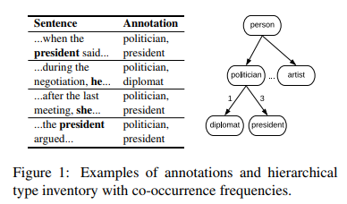

# Fine-Grained Entity Typing in Hyperbolic Space（在双曲空间中打字的细粒度实体）

## Abstract

    How can we represent hierarchical information present in large type inventories for entity typing? (我们如何表示 entity typing 中存在于大型库存中的分层信息？)

    We study the ability of hyperbolic embeddings to capture hierarchical relations between mentions in context and their target types in a shared vector space. （我们研究双曲线嵌入的能力，以捕获上下文中的提及与共享向量空间中的目标类型之间的层次关系。）

    We evaluate on two datasets and investigate two different techniques for creating a large hierarchical entity type inventory: from an expert-generated ontology and by automatically mining type co-occurrences. We find that the hyperbolic model yields improvements over its Euclidean counterpart in some, but not all cases.（我们评估两个数据集并研究两种不同的技术来创建大型分层实体类型库存：来自专家生成的本体和自动挖掘类型共现。 我们发现双曲线模型在某些情况下比欧几里德模型产生了改进，但并非所有情况都有。）

    Our analysis suggests that the adequacy of this geometry depends on the granularity of the type inventory and the way hierarchical relations are inferred. （我们的分析表明，这种几何的充分性取决于类型库存的粒度以及推断层次关系的方式。）

## 相关知识介绍

Entity typing classifies textual mentions of entities according to their semantic class. The task has progressed from finding company names (Rau, 1991), to recognizing coarse classes (person, location, organization, and other, Tjong Kim Sang and De Meulder, 2003), to fine-grained inventories of about one hundred types, with finer-grained types proving beneficial in applications such as relation extraction (Yaghoobzadeh et al., 2017) and question answering (Yavuz et al., 2016). 
（实体类型根据其语义类对实体的文本提及进行分类。 从找到公司名称到识别粗类（人，地点，组织和其他）到大约100种类型的细粒度库存，任务已经取得进展， 细粒度类型证明在关系提取和问答等应用中是有益的。）

However, large type inventories pose a challenge for the common approach of casting entity typing as a multi-label classification task, since exploiting inter-type correlations becomes more difficult as the number of types increases. 
（然而，大型库存对于将实体类型作为多标签分类任务进行投射的常见方法提出了挑战，因为随着类型数量的增加，利用类型间相关性变得更加困难。）

A natural solution for dealing with a large number of types is to organize them in hierarchy ranging from general, coarse types such as “person” near the top, to more specific, fine types such as “politician” in the middle, to even more specific, ultrafine entity types such as “diplomat” at the bottom (see Figure 1). 

（处理大量类型的一种自然解决方案是将它们组织成层级，从一般的粗略类型（如顶部附近的“person”）到更具体的精细类型（如中间的“politician”），甚至更多特定的，超细的实体类型，如底部的“diplomat”（见图1）。）

  
By virtue of such a hierarchy, a model learning about diplomats will be able to transfer this knowledge to related entities such as politicians.

Prior work integrated hierarchical entity type information by formulating a hierarchy-aware loss (Ren et al., 2016; Murty et al., 2018; Xu and Barbosa, 2018) or by representing words and types in a joint Euclidean embedding space (Shimaoka et al., 2017; Abhishek et al., 2017). （先前的工作通过制定等级感知损失或通过在欧几里德联合嵌入空间中表示单词和类型来整合分层实体类型信息。）

Noting that it is impossible to embed arbitrary hierarchies in Euclidean space, Nickel and Kiela (2017) propose hyperbolic space as an alternative and show that hyperbolic embeddings accurately encode hierarchical information. Intuitively (and as explained in more detail in Section 2), this is because distances in hyperbolic space grow exponentially as one moves away from the origin, just like the number of elements in a hierarchy grows exponentially with its depth. 
（注意到在欧几里德空间中嵌入任意层次结构是不可能的，Nickel和Kiela（2017）提出双曲空间作为替代，并表明双曲线嵌入准确地编码分层信息。 直观地（并且在第2节中更详细地解释），这是因为双曲线空间中的距离随着远离原点而呈指数增长，就像层次结构中的元素数量随着其深度呈指数增长一样。）

## 动机

While the intrinsic advantages of hyperbolic embeddings are well-established, their usefulness in downstream tasks is, so far, less clear. We believe this is due to two difficulties: 

- First, incorporating hyperbolic embeddings into a neural model is non-trivial since training involves optimization in hyperbolic space. （首先，将双曲线嵌入结合到神经模型中并非易事，因为训练涉及双曲空间中的优化。）
- 
- Second, it is often not clear what the best hierarchy for the task at hand is.（其次，通常不清楚手头任务的最佳层次结构是什么。）

## 论文工作

In this work, we address both of these issues. 
- Using ultra-fine grained entity typing (Choi et al., 2018) as a test bed,（使用超细粒度实体分型（Choi等，2018）作为试验台） 
- we first show how to incorporate hyperbolic embeddings into a neural model (Section 3). （我们首先展示如何将双曲线嵌入合并到神经模型中）
- Then, we examine the impact of the hierarchy, comparing hyperbolic embeddings of an expert-generated ontology to those of a large, automatically-generated one (Section 4). （然后，我们检查层次结构的影响，比较专家生成的本体的双曲线嵌入与大型自动生成的本体的嵌入（第4节）。）
- As our experiments on two different datasets show (Section 5), hyperbolic embeddings improve entity typing in some but not all cases, suggesting that their usefulness depends both on the type inventory and its hierarchy. 

In summary, we make the following contributions:

1. We develop a fine-grained entity typing model that embeds both entity types and entity mentions in hyperbolic space. （开发了一个细粒度的实体类型模型，它将实体类型和实体提及嵌入双曲线空间。）
2. We compare two different entity type hierarchies, one created by experts (WordNet) and one generated automatically, and find that their adequacy depends on the dataset. （我们比较了两种不同的实体类型层次结构，一个是由专家(WordNet)创建的，另一个是自动生成的，发现它们的充分性取决于数据集。）
3. We study the impact of replacing the Euclidean geometry with its hyperbolic counterpart in an entity typing model, finding that the improvements of the hyperbolic model are noticeable on ultra-fine types. （我们研究了在实体类型模型中用双曲对应物替换欧几里德几何的影响，发现双曲模型的改进在超精细类型上是值得注意的。）

## Conclusion

Incorporation of hierarchical information from large type inventories into neural models has become critical to improve performance. In this work we analyze expert-generated and data-driven hierarchies, and the geometrical properties provided by the choice of the vector space, in order to model this information. Experiments on two different datasets show consistent improvements of hyperbolic embedding over Euclidean baselines on very fine-grained labels when the hierarchy reflects the annotated type distribution. （将来自大型库存的分层信息整合到神经模型中已成为提高性能的关键。在这项工作中，我们分析了专家生成的和数据驱动的层次结构，以及通过选择向量空间提供的几何属性，以便对这些信息进行建模。在两个不同的数据集上的实验表明，当层次结构反映注释类型分布时，在非常细粒度的标签上比欧几里德基线的双曲嵌入有一致的改进。）

## 参考资料

1. [浅谈机器学习中的表示学习：从欧式空间到双曲空间](https://www.itcodemonkey.com/article/8616.html)
1. [Neural Network for Named Entity Typing方法总结
](https://little1tow.github.io/2018/07/04/2018-07-04/)
2. [引入注意力机制的细粒度实体分类
](https://blog.csdn.net/caozixuan98724/article/details/79834673)
3. [细粒度实体类型分类的神经网络结构
](https://blog.csdn.net/caozixuan98724/article/details/79855442)
4. [论文笔记：Ultra-Fine Entity Typing
](https://blog.csdn.net/xff1994/article/details/90293957)

