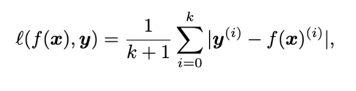

# 【关于 Conf-MPU】那些你不知道的事

> 作者：杨夕
> 
> 论文：Distantly Supervised NER via Confidence-BasedMulti-Class Positive and Unlabeled Learning
> 
> 会议：ACL2022
> 
> 论文下载地址：https://arxiv.org/abs/2204.09589
> 
> 论文代码：https://github.com/kangISU/Conf-MPU-DS-NER
> 
> 本文链接：https://github.com/km1994/nlp_paper_study
> 
> 个人介绍：大佬们好，我叫杨夕，该项目主要是本人在研读顶会论文和复现经典论文过程中，所见、所思、所想、所闻，可能存在一些理解错误，希望大佬们多多指正。
> 
> 【注：手机阅读可能图片打不开！！！】

## 目录

- [【关于 Conf-MPU】那些你不知道的事](#关于-conf-mpu那些你不知道的事)
  - [目录](#目录)
  - [一、摘要](#一摘要)
  - [二、动机](#二动机)
    - [2.1 任务介绍](#21-任务介绍)
    - [2.2 存在问题及现有解决方法](#22-存在问题及现有解决方法)
  - [三、论文方法](#三论文方法)
  - [四、前沿方法](#四前沿方法)
    - [4.1 二元正相关无标注(PU)学习](#41-二元正相关无标注pu学习)
  - [五、论文方法](#五论文方法)
    - [5.1 Conf-MPU方法](#51-conf-mpu方法)
    - [5.2 Conf-MPU机制](#52-conf-mpu机制)
    - [5.3 DS-NER Classification](#53-ds-ner-classification)
  - [六、论文总结](#六论文总结)
  - [参考](#参考)

## 一、摘要

In this paper, we study the named entity recognition (NER) problem under distant supervision. 

Due to the incompleteness of the external dictionaries and/or knowledge bases, such distantly annotated training data usually suffer from a high false negative rate. 

To this end, we formulate the Distantly Supervised NER (DS-NER) problem via Multi-class Positive and Unlabeled (MPU) learning and propose a theoretically and practically novel CONFidence-based MPU (Conf-MPU) approach. 

To handle the incomplete annotations, Conf-MPU consists of two steps. First, a confidence score is estimated for each token of being an entity token. Then, the proposed Conf-MPU risk estimation is applied to train a multi-class classifier for the NER task. 

Thorough experiments on two benchmark datasets labeled by various external knowledge demonstrate the superiority of the proposed Conf-MPU over existing DS-NER methods.

- 动机：本文研究了远程监督下的命名实体识别问题。由于外部词典和/或知识库的不完整性，这种带注释的训练数据通常具有较高的误报率。
- 方法：通过正类和未标记类（MPU）多类学习来模拟远程监督NER（DS-NER）问题，并提出了一种理论上和实践上新颖的基于置信度的MPU（Conf-MPU）方法。
- 思路：为了处理不完整的注释，Conf-MPU包括两个步骤。
  - 首先，估计了作为实体标记的每个标记的置信度分数。
  - 然后，将所提出的Conf-MPU风险估计应用于训练多类分类器，用于NER任务。
- 实验结果：通过对两个由各种外部知识标记的基准数据集的深入实验，证明了所提出的Conf-MPU优于现有的DS-NER方法。

## 二、动机

### 2.1 任务介绍

- 命名实体识别（NER）的目的: 检测文本中提及的内容，并将其分类为预定义的类型。这是信息提取和许多其他下游任务中的一项基本任务。

### 2.2 存在问题及现有解决方法

1. 问题一：需要大量标注数据
  
- 解决方法：远程监督学习方法。
 - 思路：使用基于外部知识（如词典和KB）的自动标注训练数据来训练神经网络模型；
 - 优点：字典提供的远程标签通常具有高精度
  
2. 问题二：远程监督学习方法——标签不完整：大多数现有词典和KB对实体的覆盖范围有限
 
- 存在问题：与人工标注的训练数据相比，简单地将未标记的样本（即不匹配的标记）视为阴性将引入较高的假阴性率（例如图1中的“中性粒细胞减少症”），并进一步误导有监督学习的NER模型过度拟合假阴性样本，严重影响其召回率

- 解决方法：二元正相关无标注(PU)学习
 - 思路：PU学习只使用有限的有标记的正数据和未标记的数据进行分类，因此适合处理外部知识对正样本的覆盖范围有限的远程监督学习。
 - 存在问题：二元PU学习假设无标签数据分布与所有类型数据的总体分布一致，这在实际情况中容易引起较大偏差，导致效果不好。

## 三、论文方法

论文提出了基于置信度的多类正相关无标注(Conf-MPU)学习框架。所提出的Conf-MPU能够处理不同覆盖率的字典带来的不同程度的假阴性率，并且不会在远程监督训练中产生过度拟合。
- 步骤：
  - 对于给定的远程标记训练数据，首先进行基于token-level的二分类，以估计标签作为实体标签的置信度(概率值为[0,1])。
  - 然后，利用神经网络模型和提出的Conf-MPU风险估计器进行NER分类，该风险估计器将第一步获得的置信度分数纳入风险估计，以缓解注释不完善的影响。
  - 值得注意的是，对于任意实体类型数的DS-NER任务，Conf-MPU的两步学习策略只需要训练两个分类器，比以往的二元PU学习效率更高。

## 四、前沿方法

### 4.1 二元正相关无标注(PU)学习

## 五、论文方法

### 5.1 Conf-MPU方法

然而，在实际的远程监督场景中，PU学习的假设可能并不准确。在远程监督学习知识库覆盖能力较好的情况下，无标签数据的分布可能与总体分布不同，这种情况下，无标签数据的分布将更接近真实负数据的分布，而不是整体分布。因此，基于此假设的MPU中的风险估计可能存在偏差。

代入得到Conf-MPU的风险预测：

### 5.2 Conf-MPU机制

### 5.3 DS-NER Classification

1. 远程标签生成

在DS-NER任务中，使用专业词典和知识库(如Wikidata)自动生成远程标签。字典的远程标注使用一些字符串匹配算法将训练样本映射到字典，而知识库利用公共API执行远程标记。

2. 分类器

本文所提出的Conf-MPU风险估计器可以应用于任何NER分类器预测每个令牌的标签的任务中，例如以BERT或者 BiLSTM作为作为底层的NER模型。

3. 先验估计

在监督学习中，先验（即之前提到的 πi）可以很容易地从人工标注中获得，而不能直接从远程监督标注中获得。在PU学习研究中，有一些方法是专门针对先验估计提出的。本文采用TIcE算法进行先验估计。

4. 损失函数

本文作者在实验中采用平均绝对误差(MAE)作为Conf-MPU学习方法的损失函数，而不是使用常见的无界交叉熵损失函数。这是因为有界损失函数有助于避免PU学习中的过拟合问题。

## 六、论文总结

本文针对DS-NER任务提出了一种新的基于置信度的多类正相关无标注方法Conf-MPU。Conf-MPU利用远程标记训练数据的置信度来进行分类风险估计，以避免模型对未标记数据中的假阴性样本过拟合。大量实验表明，与现有的DS-NER方法相比，Conf-MPU对各种类型的字典具有更强的鲁棒性，能够有效地处理不完全标注问题。

## 参考

1. [Distantly Supervised Named Entity Recognition via Confidence-Based Multi-Class Positive and Unlabeled Learning](https://arxiv.org/abs/2204.09589)

