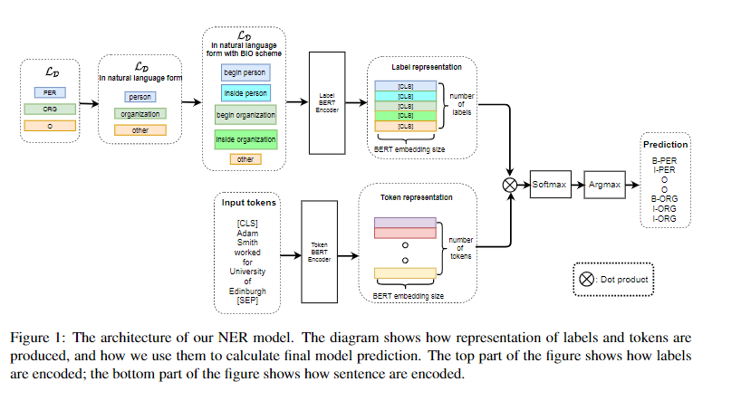

# 【关于 Label Semantics for Few Shot NER】 那些你不知道的事

> 作者：杨夕
> 
> 项目地址：https://github.com/km1994/nlp_paper_study
> 
> 论文名称：Label Semantics for Few Shot Named Entity Recognition
> 
> 会议：ACL2022
> 
> 论文地址：https://arxiv.org/abs/2203.08985
> 
> 源码地址：
> 
> 个人介绍：大佬们好，我叫杨夕，该项目主要是本人在研读顶会论文和复现经典论文过程中，所见、所思、所想、所闻，可能存在一些理解错误，希望大佬们多多指正。

## 摘要

We study the problem of few shot learning for named entity recognition. Specifically, we leverage the semantic information in the names of the labels as a way of giving the model additional signal and enriched priors. We propose a neural architecture that consists of two BERT encoders, one to encode the document and its tokens and another one to encode each of the labels in natural language format. Our model learns to match the representations of named entities computed by the first encoder with label representations computed by the second encoder. The label semantics signal is shown to support improved state-of-the-art results in multiple few shot NER benchmarks and on-par performance in standard benchmarks. Our model is especially effective in low resource settings.

- 动机：命名实体识别的少数镜头学习问题。
- 论文方法：
  - 利用标签名称中的语义信息作为为模型提供额外信号和丰富先验的一种方式；
  - 提出了一种由两个 BERT 编码器组成的神经架构：
    - 一个用于编码文档及其标记；
    - 一个用于以自然语言格式对每个标签进行编码。
  - 我们的模型学习将第一个编码器计算的命名实体的表示与第二个编码器计算的标签表示相匹配。
- 实验结果：标签语义信号被证明可以在多个少数镜头 NER 基准测试中支持改进的最先进的结果，并在标准基准测试中提供同等性能。我们的模型在资源匮乏的环境中特别有效。

## 一、思路

用双塔模型来解决Few shot NER的问题，他们用了两个BERT Encoder，一个Encoder编码，每个token的表征，另一个Encoder对label的BIO tag的自然语言形式(或者用其他文本对Label进行描述)进行编码，获取Label 表征，然后求待预测文本中每个token与所有label表征的相似度，求相似度最大的label。

## 二、模型

## 参考资料

1. [ACL2022小样本NER SOTA: Label Semantics for Few Shot Named Entity Recognition](https://zhuanlan.zhihu.com/p/499697214)

