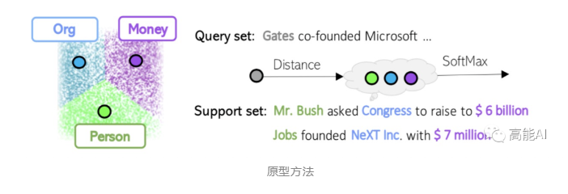
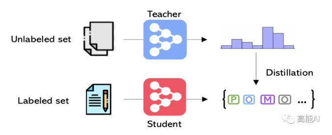
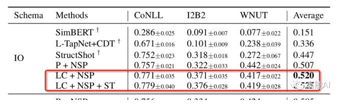

# 少样本NER

> 作者：杨夕
> 
> 论文名称：Few-Shot Named Entity Recognition: A Comprehensive Study
> 
> 论文地址：
> 
> 论文代码：
> 
> 项目地址：https://github.com/km1994/nlp_paper_study
> 
> 个人介绍：大佬们好，我叫杨夕，该项目主要是本人在研读顶会论文和复现经典论文过程中，所见、所思、所想、所闻，可能存在一些理解错误，希望大佬们多多指正。

## 一、动机

1. BERT等预训练语言模型 虽然能一定程度上缓解少样本问题，但不能完全解决；
2. 结合领域内的大量未标注数据进行「持续预训练」，当标注数据太少时，作用不大；
3. NER任务中的少样本问题 相比于 其他NLP任务较复杂；
   1. 分类问题通常是sentence-level的，而NER是token-level的，其会更加聚焦于细粒度信息，换句话说：NER任务对于局部噪声会更为敏感，一些弱/半监督方式带来的噪声或许会让NER“难以容忍”；
   2. NER任务标注起来要麻烦很多，这从直觉上就能感觉到：要“扣”边界、理解实体类型，边界问题、复杂嵌套问题都比较麻烦。特别是在「定制化开发」场景中，实体标签数量成百上千；

## 二、方法介绍

### 2.1 方法1 原型方法(Prototype Methods)

#### 2.1.1 原型方法(Prototype Methods) 方法介绍

元学习的一种，首先构建实体类型的原型表示，然后通过距离度量（最近邻）给token分别标签。

#### 2.1.2 原型方法(Prototype Methods) Training阶段流程

1. 将训练集采样成Support Set(支撑集)和Query Set(查询集)两部分；
2. 基于Support Set训练1个分类模型；
3. 利用模型对Query Set进行分类预测生成predict labels；
4. 通过query labels和predict labels进行Loss计算并更新参数；

#### 2.1.3 原型方法(Prototype Methods) Testing阶段流程

利用Training阶段的分类模型在Novel class(未知类别)的Support Set上进行进一步学习(参数不更新)，学到的模型对Novel class的Query set进行预测。

#### 2.1.4 原型方法(Prototype Methods) 针对「少样本NER」

- Training阶段：首先基于Support Set对每一个实体类型构建原型表示(提取所有构成该实体类型的token表示并进行平均加权)，然后对Query Set中的每个token与实体原型表示进行距离度量、构建对比loss学习。
- Testing阶段：对每一个新token与实体原型表示进行距离度量，选取最近邻的实体原型标签。

#### 2.1.5 原型方法(Prototype Methods) 适用场景

原型方法(Prototype Methods) 适合于标注数据极少的场景，或者在线学习场景(不能更新参数)、对未知类型实体进行预测。

### 2.2 方法2 带噪有监督预训练(Noisy Supervised Pretraining)

#### 2.2.1 带噪有监督预训练(Noisy Supervised Pretraining) 方法介绍

持续预训练的一种改进方式，利用大规模、带噪的NER标注数据进行「有监督预训练」，提升下游NER任务的鲁棒性和泛化性。

以 WiNER数据 数据集为例

1. 通过Freebase进行自动标注得到 Wikipedia数据；
2. 然后利用 Wikipedia数据 进行微调；

#### 2.2.2 带噪有监督预训练(Noisy Supervised Pretraining) 方法 优点

通过利用先验信息、这种带噪预训练的方式可防止“少样本NER”的过拟合、并提升鲁棒性和泛化性

### 2.3 方法3 自训练(Self-Training)

### 2.3.1 自训练(Self-Training) 介绍

通过对领域内的未标注数据预测soft标签进行自训练。

### 2.3.2 自训练(Self-Training) 步骤

1. 基于原始标注数据训练一个NER教师模型。
2. 通过NER教师模型对未标注数据预测soft标签。
3. 基于「原始标注+soft标注」数据训练NER学生模型。
4. 重复步骤1～3多次。

## 三、方法对比

论文基于10个公开NER数据集、并设置少样本条件，对上述3种方案进行了对比。由于实验繁多，这里直接给出结论：

1. 原型方法在NER标注数据量极少的情况下，表现良好；
2. 带噪有监督预训练在众多「少样本NER」设置下表现最佳，可见持续预训练的有效性、同时可提升NER的鲁棒性和泛化性。
3. 「带噪有监督预训练+自训练」结合指标可进一步提升。

## 参考

1. [微软+韩家炜课题组的全面调研：NER标注数据少，怎么办？](https://mp.weixin.qq.com/s/cDAjaQEE4zyoe-KMWawQOA)
