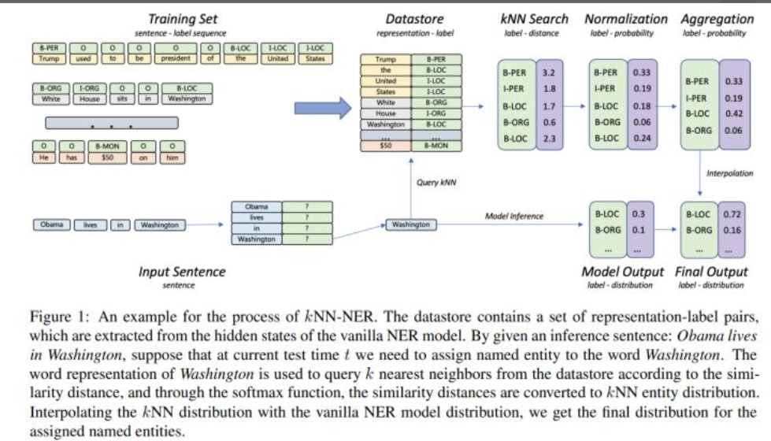

# kNN-NER：利用knn近邻算法来做命名实体识别

> 作者：杨夕
> 
> 论文名称：<kNN-NER: Named Entity Recognition with Nearest Neighbor Search >
> 
> 论文地址：https://arxiv.org/pdf/2203.17103.pdf
> 
> 论文代码：https://github.com/ShannonAI/KNN-NER
> 
> 项目地址：https://github.com/km1994/nlp_paper_study
> 
> 个人介绍：大佬们好，我叫杨夕，该项目主要是本人在研读顶会论文和复现经典论文过程中，所见、所思、所想、所闻，可能存在一些理解错误，希望大佬们多多指正。

## 目录

## 摘要

Inspired by recent advances in retrieval augmented methods in NLP (Khandelwal et al.,2019, 2020; Meng et al., 2021b) , in this paper, we introduce a k nearest neighbor NER (kNNNER) framework, which augments the distribution of entity labels by assigning k nearest neighbors retrieved from the training set. This strategy makes the model more capable of handling long-tail cases, along with better few-shot learning abilities. kNN-NER requires no additional operation during the training phase, and by interpolating k nearest neighbors search into the vanilla NER model, kNNNER consistently outperforms its vanilla counterparts: we achieve a new state-of-the-art F1-score of 72.03 (+1.25) on the Chinese Weibo dataset and improved results on a variety of widely used NER benchmarks. Additionally, we show that kNN-NER can achieve comparable results to the vanilla NER model with 40% less amount of training data.

- 动机：受 NLP 中检索增强方法的最新进展的启发（Khandelwal 等人，2019，2020；Meng 等人，2021b）；
- 论文方法：介绍了一个 k 最近邻 NER（kNNNER）框架，该框架增强了实体标签的分布 通过分配从训练集中检索到的 k 个最近邻。 这种策略使模型更有能力处理长尾案例，以及更好的小样本学习能力。 
- 效果：kNN-NER 在训练阶段不需要额外的操作，并且通过将 k 最近邻搜索插入到 vanilla NER 模型中，kNNNER 始终优于其 vanilla 对应物：我们实现了 72.03 的最新 F1 分数（+ 1.25）在中国微博数据集上，并在各种广泛使用的 NER 基准上改进了结果。 此外，我们表明 kNN-NER 可以达到与普通 NER 模型相当的结果，而训练数据量减少了 40%。

## 核心思路

- 在训练阶段，按正常的序列任务训练一个常规的NER模型；
- 在推理阶段，由常规模型预测一个分布+由kNN检索出来的一个分布，两个分布融合作为最终的预测分布，从而达到提高NER识别效果。
 
换一个角度来看，论文提出的kNN-NER框架其实是一种较为简洁的集成算法，将序列模型+kNN模型预测的结果进行集成，而kNN模型在检索中可以利用序列模型形成的分布，进而在训练过程中并不需要额外的操作。文中将推理过程中加入kNN方法视为一种检索式的数据增强方法（retrieval augmented methods）。

## 参考

1. [kNN-NER：利用knn近邻算法来做命名实体识别](https://zhuanlan.zhihu.com/p/493191362?utm_source=wechat_session&utm_medium=social&utm_oi=1090917895634096128)

