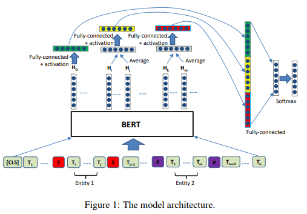
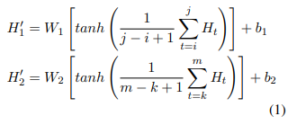
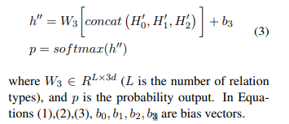

# Enriching Pre-trained Language Model with Entity Information for Relation Classification

## 资料

链接：https://github.com/monologg/R-BERT
论文：https://arxiv.org/abs/1905.08284

## 摘要

关系分类的主要方法是基于卷积或循环神经网络的模型；

在本文中，我们提出了一个既利用预训练的BERT语言模型又结合了来自目标实体的信息来解决关系分类任务的模型。 我们找到目标实体，并通过预训练的体系结构传输信息，并结合两个实体的相应编码。 与SemEval2010任务8关系数据集的最新方法相比，我们取得了显着改进。

## 思路

1. 在目标实体之前和之后插入特殊标记；
2. 再将文本输入BERT以进行微调，以识别两个目标实体的位置并将信息传递到BERT模型中。 
3. 在BERT模型的输出嵌入中找到两个目标实体的位置。 
4. 使用它们的嵌入以及句子编码（在BERT设置中嵌入特殊的第一个标记）作为多层神经网络的输入进行分类。 
   
通过这种方式，它可以捕获句子和两个目标实体的语义，从而更好地适合关系分类任务。

## 方法介绍

给定一个带有实体e1和e2的句子s，假设其从BERT模块输出的最终隐藏状态向量为H.

假设向量Hi至Hj是实体e1从BERT的最终隐藏状态向量，

而Hk至Hm是实体e2从BERT的最终隐藏状态向量。 

我们应用平均运算来获得两个目标实体中每个实体的矢量表示。 

然后在激活操作（即tanh）之后，我们将完全连接的层添加到两个向量的每一个中，并且e1和e2的输出分别为H'1和H'2。

我们使W1和W2，b1和b2共享相同的参数。 换句话说，我们设置W1 = W2，b1 = b2。 对于第一个令牌的最终隐藏状态向量（即“ [CLS]”），我们还添加了一个激活操作和一个完全连接的层：

We concatenate H'0 , H'1 , H'2 and then add a fully connected layer and a softmax layer, which can be expressed as following:

## 结论

In this paper, we develop an approach for relation classification by enriching the pre-trained BERT model with entity information. We add special separate tokens to each target entity pair and utilize the sentence vector as well as target entity representations for classification. We conduct experiments on the SemEval-2010 benchmark dataset and our results significantly outperform the stateof-the-art methods. One possible future work is to extend the model to apply to distant supervision.

