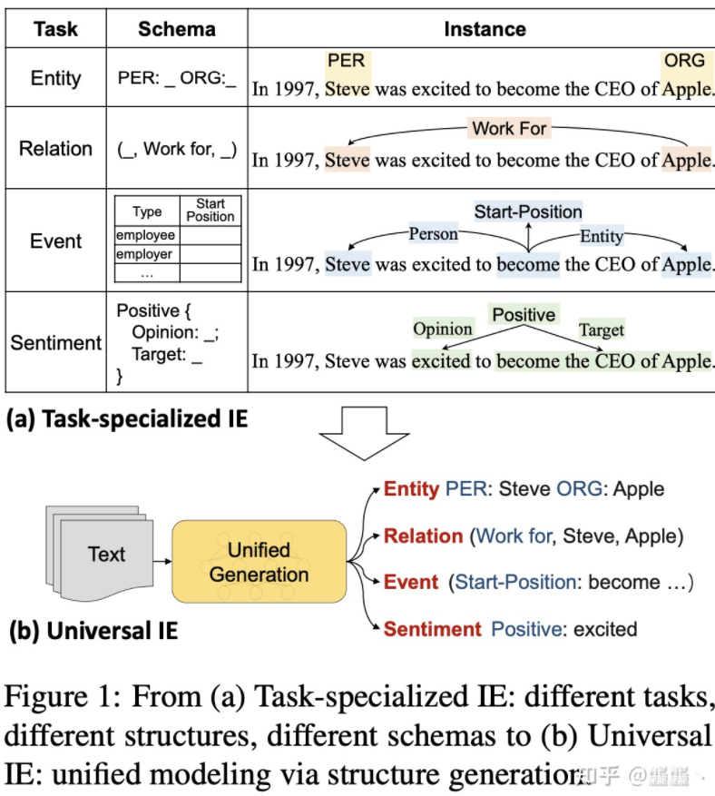
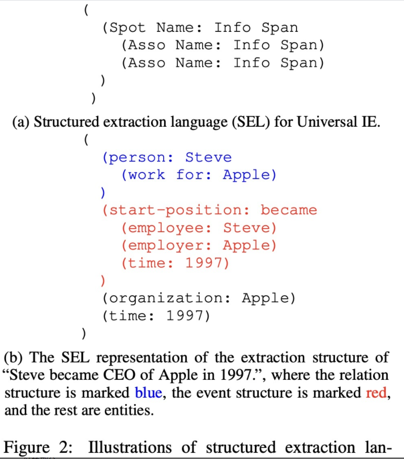
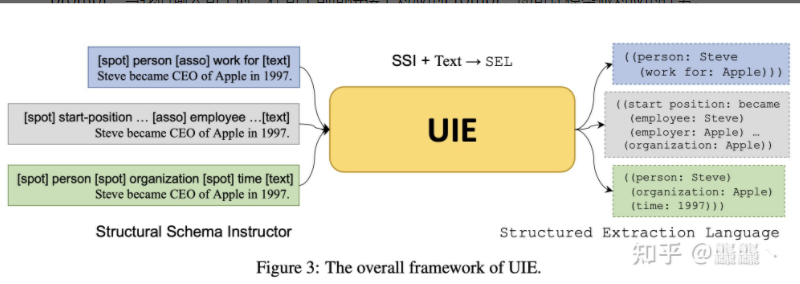
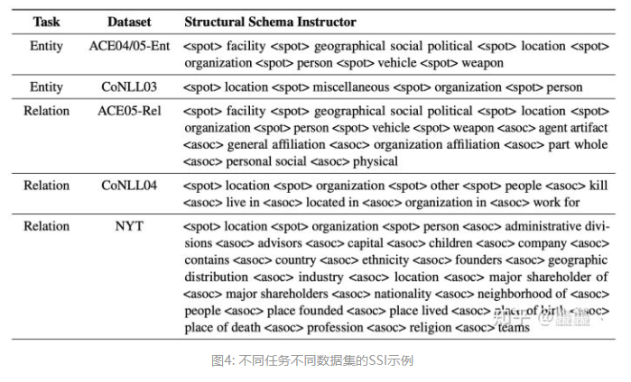

# 【关于 UIE】 那些你不知道的事 

> 作者：杨夕
> 
> 介绍：研读顶会论文，复现论文相关代码

> 论文：Unified Structure Generation for Universal Information Extraction
>
> 会议：ACL2022
> 
> 论文地址：https://arxiv.org/abs/2203.12277
> 
> NLP 百面百搭 地址：https://github.com/km1994/NLP-Interview-Notes
> 
> **[手机版NLP百面百搭](https://mp.weixin.qq.com/s?__biz=MzAxMTU5Njg4NQ==&mid=100005719&idx=3&sn=5d8e62993e5ecd4582703684c0d12e44&chksm=1bbff26d2cc87b7bf2504a8a4cafc60919d722b6e9acbcee81a626924d80f53a49301df9bd97&scene=18#wechat_redirect)**
> 
> 推荐系统 百面百搭 地址：https://github.com/km1994/RES-Interview-Notes
> 
> **[手机版推荐系统百面百搭](https://mp.weixin.qq.com/s/b_KBT6rUw09cLGRHV_EUtw)**
> 
> 搜索引擎 百面百搭 地址：https://github.com/km1994/search-engine-Interview-Notes 【编写ing】
> 
> NLP论文学习笔记：https://github.com/km1994/nlp_paper_study
> 
> 推荐系统论文学习笔记：https://github.com/km1994/RS_paper_study
> 
> GCN 论文学习笔记：https://github.com/km1994/GCN_study
> 
> **推广搜 军火库**：https://github.com/km1994/recommendation_advertisement_search

> 手机版笔记，可以关注公众号 **【关于NLP那些你不知道的事】** 获取，并加入 【NLP && 推荐学习群】一起学习！！！

> 注：github 网页版 看起来不舒服，可以看 **[手机版NLP论文学习笔记](https://mp.weixin.qq.com/s?__biz=MzAxMTU5Njg4NQ==&mid=100005719&idx=1&sn=14d34d70a7e7cbf9700f804cca5be2d0&chksm=1bbff26d2cc87b7b9d2ed12c8d280cd737e270cd82c8850f7ca2ee44ec8883873ff5e9904e7e&scene=18#wechat_redirect)**

## 一、研究背景

信息抽取旨在从无结构的自然语言文本中抽取出结构化的信息。

但是不同的信息抽取任务都有不同的结构，且差异较大。如图1所示。

- 实体识别任务：一般是采用span及其实体类别表示；
- 关系抽取任务：一般采用三元组(triplet)结构表示;
- 事件抽取任务：一般采用记录(record)表示;
- 观点抽取任务：采用三元组(triplet)来表示。

## 二、研究动机

不同的输出结构使得很难对所有信息抽取任务统一化建模，这样就产生了三个问题：

- 由于不同的任务、不同的设置（全监督、低资源、少样本、零样本）、不同的作用场景（医学、金融等），研究人员需要设计大量针对特定情况的模型，这是一件极其耗费资源的事情；
- 不同的任务有很多可以公用的知识，比如从图1中的(a)图可以看出：关系抽取需要用到命名实体识别的结果，事件抽取中的论元也是实体，而**现在存在大量的针对特定任务的模型无法做到共享这些实体知识**。
- 信息抽取的数据标注是一件极其耗费时间和人力的事情，但由于任务之间的独立，需要对每一个任务都标注数据。

## 三、论文贡献

1. 设计了一种结构化抽取语言(Structural Extraction Language, SEL)，它能够将四种信息抽取任务的不同结构统一描述，使得模型的输出结构针对不同任务都是一致的。
2. 由于模型可以做多个任务，所以需要一种方式去指导模型做指定的任务，因此作者设计了结构化模式指导器(Structural Schema Instructor, SSI)，其实这就是一种prompt。
3. 由于模型的输出都是符合SEL语法的结构化信息，而目前常用的生成式预训练模型如T5、BART都是以生成自然语言为主，若直接采用这种预训练模型会影响到模型性能，因此作者专门针对text to structure的结构来预训练了一个大模型

## 四、如何统一每一个信息抽取任务？

### 4.1  统一信息抽取任务输出结构的结构化抽取语言SEL

作者发现四种信息抽取任务的目标都可以拆解成两个原子操作：

- **Spotting**：**指在输入的原句中找到目标信息片段**，比如说实体识别中某个类型的实体，事件抽取中的触发词和论元，他们都是原句中的片段。
- **Associating**：**指找出Spotting输出的信息片段之间的关系**，比如关系抽取中两个实体之间的关系，或事件抽取中论元和触发词之间的关系。

而每个信息抽取任务都可以用这两个原子操作去完成，因此作者设计了结构化抽取语言SEL可以对这两个原子操作进行表示，不同的任务只要组合不同的原子操作对应结构即可统一表示。

作者使用三种形式来表示(如图2（a）): 

- (1) Spot Name: **指目标信息片段的类别**，在实体抽取中指实体类别，在事件抽取中可以指事件类型和论元类别。
- (2) Info Span: **Spotting操作的输出，即原句子中的目标信息片段**。 
- (3) Asso Name: **指两个信息片段之间的关系类型**，也就是Associating操作的输出。

每个信息抽取任务都可以统一的用SEL语法描述(如图2（b）)，这里都是以"Steve became CEO of Apple in 1997."为例。其中蓝色部分表示关系抽取任务，采用(Spot Name: Info Span (Asso Name: Info Span))格式，这里的关系指第一个括号里的实体和第二个括号里的实体的关系。其中红色部分指事件抽取任务，采用(Spot Name: Info Span (Asso Name: Info Span) (Asso Name: Info Span) ...)格式来表示，其中外括号里的Spot Name信息指的是事件类型及触发词，而中间的多个内括号指的是这个事件下多个论元的片段和类别。灰色部分指命名实体识别任务，由多个(Spot Name: Info Span)组成，每一对括号都指一个实体片段及其类别。

综上，可以看到SEL语法可以统一化描述每一个任务不同的输出结构，并且由于拥有很强的结构性，使得解码过程非常简单。

### 4.2  指导模型做特定任务的结构化模式指导器SSI

- 动机：有了SEL语法，模型统一了不同任务的输出结构，但是当我们输入一个句子后，如何让模型去做我们想要的任务呢？
- 论文方法：SSI(Structural Schema Instructor) （一种基于Schema的prompt）
- 思路：当我们输入句子时，在句子前面拼接上对应的Prompt，即可让模型做对应的任务。

- 实例：
  - 第一个蓝色部分是关系抽取，它的SSI格式是: [spot] 实体类别 [asso] 关系类别 [text]，这种形式可以告诉模型哪些做spotting操作，哪些做associating操作。
  - 第二个灰色部分是事件抽取，SSI格式是: [spot] 事件类别 [asso] 论元类别 [text]。
  - 第三个绿色部分是实体识别，SSI格式是: [spot] 实体类别 [text]。

文章的附录中列出了每一个数据集每一个任务对应的SSI，因为不同的数据集所设置的Schema是不同的，因此每个数据集都有不同的SSI，虽然例子中只列出了部分类别，但是在使用时SSI就是将所有的类别都列举出来，部分示例如图4所示。

## 参考

1. [信息抽取新SOTA: UIE--首个结构化生成式信息抽取预训练语言模型，一统信息抽取四大任务](https://zhuanlan.zhihu.com/p/495315026)

