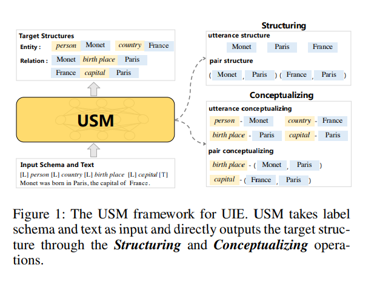
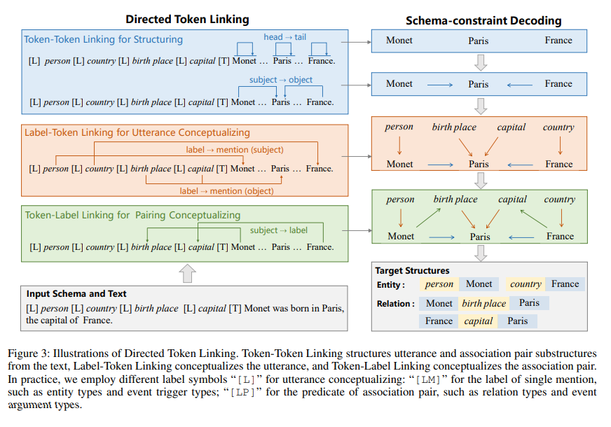
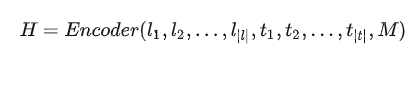
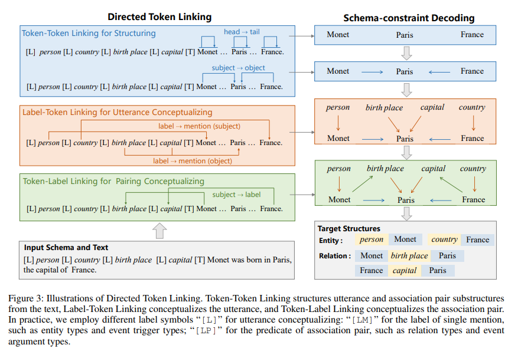
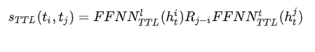
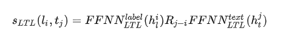
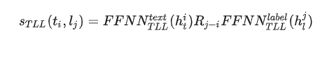
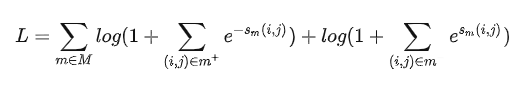

# 【关于 USM 】 那些你不知道的事 

> 作者：杨夕
> 
> 介绍：研读顶会论文，复现论文相关代码

> 论文：Universal Information Extraction as Unified Semantic Matching
>
> 会议：AAAI2023
> 
> 论文地址：https://arxiv.org/abs/2301.03282
> 
> NLP 百面百搭 地址：https://github.com/km1994/NLP-Interview-Notes
> 
> 推荐系统 百面百搭 地址：https://github.com/km1994/RES-Interview-Notes
> 
> 搜索引擎 百面百搭 地址：https://github.com/km1994/search-engine-Interview-Notes 【编写ing】
> 
> NLP论文学习笔记：https://github.com/km1994/nlp_paper_study
> 
> 推荐系统论文学习笔记：https://github.com/km1994/RS_paper_study
> 
> GCN 论文学习笔记：https://github.com/km1994/GCN_study
> 
> **推广搜 军火库**：https://github.com/km1994/recommendation_advertisement_search

> 手机版笔记，可以关注公众号 **【关于NLP那些你不知道的事】** 获取，并加入 【NLP && 推荐学习群】一起学习！！！

## 一、动机

信息抽取（Information Extraction，IE）任务 主要包含 实体抽取、事件抽取、关系抽取等任务，不同的抽取任务所对应的抽取目标存在差异。

- 传统的信息抽取方法：需要**针对特定的任务进行模型设计和数据标注**，使得难以推广到新的模式中，极大限制了IE系统的使用。
- UIE 通用信息抽取方法：
  - 思路：**使用一个通用模型来解决不同信息抽取任务，提出了一种Seq2Seq的生成模型，以结构化模式提示器+文本内容作为输出，直接生成结构化抽取语言，最终获取信息抽取内容**；
  - 问题：由于**Seq2Seq的生成模型的黑盒特性**，导致无法判断跨任务或跨模式的迁移在什么情况下会成功or失败；

- 信息抽取（Information Extraction，IE）任务 所包含的多样性任务和抽取目标，可以通过以下两种操作进行解耦：
  - **结构化（Structuring）**：**从文本中抽取目标结构中标签未知的基本子结构，以重新建立抽取目标结构与文本的语义信息**（eg：抽取“Monet”、“Paris”、“France”等文本或者“ Monet-Paris”、“France-Paris”等文本pair对）；
  - **概念化（Conceptualizing）**：**将抽取文本和文本pair对与目标语义标签进行对应**（例如：“Monet”与“person”标签进行对应，“Monet”-"Paris"与“birth place”标签进行对应）

- 动机：**是否可以将信息抽取转换为一系列结构化和概念化的组合，利用结构和模式之间的语义匹配重新表述所有这些操作，并在同一范式下共同学习所有IE任务，就可以用一个通用架构轻松地执行各种IE任务，实现在不同的目标结构和语义模式之间进行共享抽取的功能。**
- 存在问题：直接在结构和模式之间进行语义匹配对于通用信息提取是不切实际的：
  - 句子具有许多子结构，导致大量潜在匹配候选和大规模匹配，这使得模型的计算效率无法接受；
  - IE的模式是结构化的，很难与纯文本匹配；

本文介绍一种 **通用IE的 directed token linking** 。其主要思想是将结构化（Structuring）和概念化（Conceptualizing）转换为一系列 directed token linking operations，这些操作可以恢复为 utterances and schema 之间的语义匹配。

## 三、USM 方法介绍

本文介绍一种 统一语义匹配框架（Universal Information Extraction，USM）方法：

- 介绍：对各种信息提取任务进行统一建模，明确模型在迁移过程的有效性、健壮性和可解释性

### 3.1 Unified Semantic Matching via Directed Token Linking

- USM框架：以任意抽取标签模式和原始文本作为输入，根据给定的模式直接输出结构 （eg： given the text “Monet was born in Paris, the capital of France”, USM needs to extract (“France”, capital, “Paris”) for the relation type capital and (person, “Monet”)/(country, “France”) for the entity type person and country）
- 存在挑战：
  - 1） 如何利用共享的结构化能力统一地提取异构结构；
  - 2） 如何在不同的 label schemas 下统一表示不同的提取任务，以共享共同的概念化能力
- USM思路：
  - 1. 描述所有 label schemas，并学习 schema-text joint embedding，以构建 shared label text semantic space；
  - 2. 描述了三个 basic token linking operations，以及如何使用这三个操作结构化和概念化文本中的信息；
  - 3. 介绍如何使用 schema constraint decoding 对最终结果进行解码。

#### 3.1.1 Schema-Text Joint Embedding

- 动机：如何 捕捉标签模式和文本之间的关联？
- 思路：

1. 学习 schema labels and text tokens 的 joint contextualized embeddings （将 extraction schema s 实例化为token序列 $l={l_1,l_2,...,l_{|l|}}$）;
2. 将 token序列 l 和 文本序列 $t ={t_1,t_2,...,t_{|t|}}$ 进行拼接，并作为输入；
3. 计算标签-文本联合嵌入 $H={h1,h2,..,h_{|l|+|t|}}$

> 注：Encoder(·) 为Transformer的Encoder结构，M 为掩码矩阵，用于确定一对Token之间是否可以相互作用。

#### 3.1.2 Token-Token Linking for Structuring

在得到 joint label-text embeddings 后 $H={h^l_1,...,h^l_{|l|},h^t_1,...,h^t_{|t|}}$，USM框架使用 Token-Token Linking (TTL) operations 抽取所有有效的文本片段。

- Utterance：输入文本中的一段连续Token序列（例如：实体文本“Monet”、事件触发词“born in”等。如图3所示，通过片段的头尾连接（H2T），抽取一个文本片段。例如，“Monet”是自身到自身，“born in”是“born”到“in”）。
- Association pair：输入文本中的相关文本pair对，例如，具有主客体关系的“Monet”-“Paris”文本对，具有触发词-要素关系的“born in”-“Paris”文本对。如图3所示，通过头头连接（H2H）和尾尾连接（T2T），抽取文本对。

对于上述三种Token到Token链接(H2T, H2H, T2T)操作，USMk框架分别对所有有效的token-pair候选集中token-to-token 链接进行评分，对于每个token-pair $<t_i,t_j>$，链接 $s_{TTL}(t_i,t_j)$ 分数如下：

> 注：其中，$FFNN^{l/t}$ 为输出维度的前馈层，$R_{j-i}$ 为旋转位置嵌入，可以有效地将相对位置信息注入到对应的结构中。

#### 3.1.3 Label-Token Linking for Utterance Conceptualizing

在得到 标签嵌入 $h^l_1,...,h^l_{|l|}$ 和文本嵌入 $h^t_1,...,h^t_{|t|}$ 后，USM框架使用 label-token链接(LTL)操作将有效的文本进行概念化。

LTL操作的输出是标签名词和文本内容的pair对，例如："person"- “Monet”、"country"-“Paris”等。 有两种类型的概念化：

- 实体的类型，即为每一个文本分配标签类型，例如，实体“Monet”的类型为person;
- 客体的谓词，即将谓词类型赋给每个候选客体，例如，客体“Paris”的谓语词为birth place。 其中，实体的类型和客体的谓词在概念化时采用相同的LT操作，使得两种标签语义之间相互加强。并按照头尾片段抽取风格，使用label到head(L2H)和label到tail(L2T)来定义L2T链路操作，例如，客体的谓词“Paris”-“birth place”，将标签“birth place”的头“birth”与客体“Paris”链接，将标签“birth place”尾头“ place”与客体“Paris”链接。计算LTL的得分，如下：

#### 3.1.4 Token-Label Linking for Pairing Conceptualizing

为了概念化文本pair对，USM框架使用 Token-Label链接（TLL）将文本pair对的主体链接到标签上。也就是，TLL操作用head到label(H2L)和tail到label(T2L)操作连接了三元组中主体和谓语词。例如，主体“Monet”的head“Monet”链接标签“birth place”的head“birth”，主体“Monet”的tail“Monet”链接标签“birth place”的tail“place”。计算TLL的得分，如下：

#### 3.1.5 Schema-constraint Decoding for Structure Composing

USM框架采用模式约束解码算法来解码最终结构，通过统一的token-linking操作提取给定的文本结构。如图3所示，USM框架，首先解码由TTL操作提取的实体文本和主客体文本，例如：“Monet”，“Paris”，“France”，“Monet”-“Pairs”，“France”-“Pairs”；然后通过LTL操作对标签名词和文本内容的pair对进行解码，例如：“person”-“Monet”，“country”-“France”，“birth place”-“Paris”，“capital”-“Paris”；最后利用TLL操作对标签及文本对进行解码，例如：“Monet”-“birth place”，“France”-“capital”。

由于以上三种链接操作互不影响，因此，在进行模型推理过程中，三种操作是高度并行的。

最后，可以根据从输入类型的模式定义，将实体类型country和person与关系类型 birth place和capital分离出来。根据TLL操作的结果“Monet”-“birth place”，“France”-“capital”，可以得到完整的三元组结构“Monet”-“birth place”-Paris和“France”-“capital”-“Paris”。

### 3.2 Learning from Heterogeneous Supervision

本文利用异构监督资源来学习统一令牌链接的通用结构和概念化能力，通过语言化的标签表示和统一的token链接，将异构的监督数据统一为<text，token pairs>进行预训练。

#### 3.2.1 Pre-training

USM框架对共享语义表示中的标签模式和文本进行统一编码，并使用统一的token-linking对文本中的信息进行结构化和概念化。帮助为了学习常见的结构和概念化能力，本文收集了三种不同的监督数据用于USM的预训练。

- 任务数据：来自信息抽取任务的标注数据，即数据样本都有一个金标准。
- 远程监督数据：数据样本来自文本和知识库对齐。
- 间接监督数据：数据样本来自其他相关的NLP任务，主要使用机器阅读理解的数据，将（问题-文档-答案）实例中问题作为标签模式，文档作为输入文本，答案作为提及。

#### 3.2.2 Learning function

在训练过程中，由于token-linking占比仅为所有token链接候选集合的1%，因此在模型优化过程中，标签的极端稀疏性是要重点解决的问题。

主要采用类别不平衡损失函数，

> 其中，M 表示USM框架中的链接类型，$m+$ 表示链接对，$m-$表示非链接对，$s_m(i,j)$表示链接操作的分数。

## 参考

1. [Universal Information Extraction as Unified Semantic Matching](https://arxiv.org/pdf/2301.03282.pdf)
2. [AAAI2023 | 基于统一语义匹配的通用信息抽取框架-USM](https://zhuanlan.zhihu.com/p/598882471)
3. [Unified Structure Generation for Universal Information Extraction](https://arxiv.org/pdf/2203.12277.pdf)

